# SuperDucky

Simple gallery of the current UI and behaviors.

点击链接加入群聊【逃离鸭科夫 mod 技术交流】：https://qm.qq.com/q/6kHzE1Pjk4

## 文档

[](https://ducky7go.github.io//SuperDucky.docs/)
[](https://apps.microsoft.com/store/detail/9ndbtdkqbx30)

## 部署

### Windows Store 自动发布

本项目支持完全自动化发布到 Windows Store。当创建包含 `.appx` 文件的 GitHub Release 时，或者推送到 `publish` 分支时，系统会自动将应用包上传并提交到 Windows Store，无需任何手动操作。

**功能特性**:
- 自动监听 GitHub Release 创建事件
- 支持 `publish` 分支触发（重新发布最新版本）
- 自动提取并下载 `.appx` 应用包
- 通过 Azure AD 进行 OAuth 认证
- 创建新的 Windows Store 提交
- 将 .appx 文件上传到 Azure Blob Storage
- 自动提交应用到 Windows Store
- 监控提交状态并提供详细日志
- 完整的错误处理和重试机制

**使用 UWP Store Submission API**:
- 支持直接文件上传（无需公开 URL）
- 使用 `https://manage.devcenter.microsoft.com` API endpoint
- 完全自动化，无需手动干预

**配置指南**:
详细的配置步骤请参阅 [Windows Store 自动发布配置指南](docs/deployment/windows-store-auto-publish.md)

**前置条件**:
1. 应用必须在 Partner Center 中已存在并至少有一次成功的提交
2. Azure AD 应用必须在 Partner Center 中配置并分配 Manager 角色

**快速开始**:
1. 配置 GitHub Secrets（参考配置指南）
2. 创建包含 `.appx` 文件的 GitHub Release
3. 系统自动执行完整的发布流程
4. 在 [Partner Center](https://partner.microsoft.com/dashboard) 查看认证状态

**使用 Publish 分支重新发布**:
```bash
# 创建 publish 分支并推送，将自动发布最新版本
git checkout -b publish
git push origin publish
```

**故障排除**:
如遇到问题，请参考 [故障排除文档](docs/deployment/troubleshooting.md)

## Demo shots

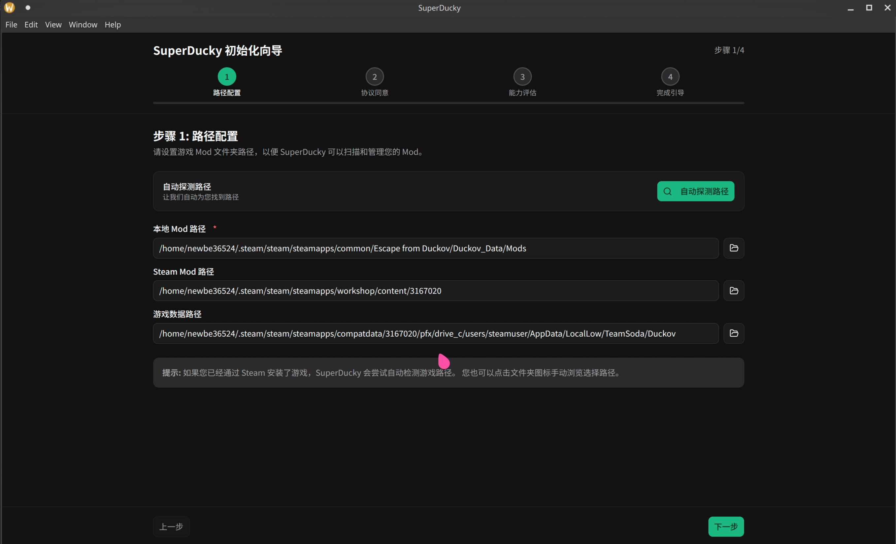
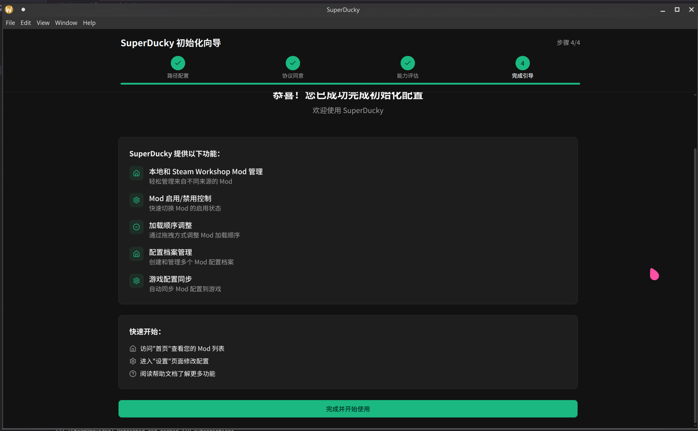
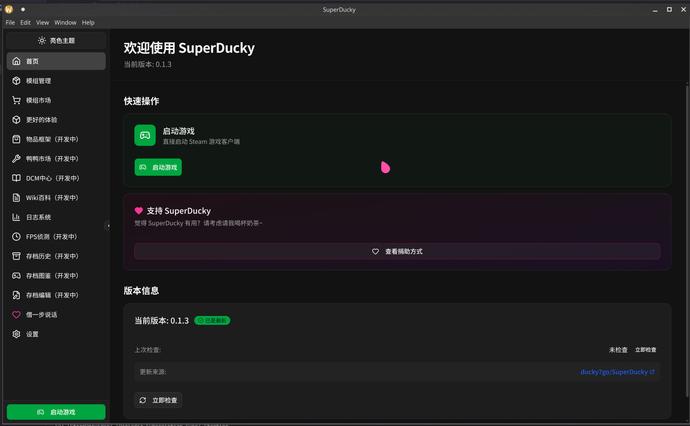
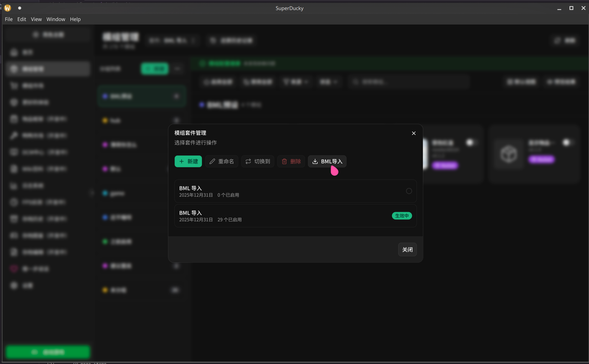
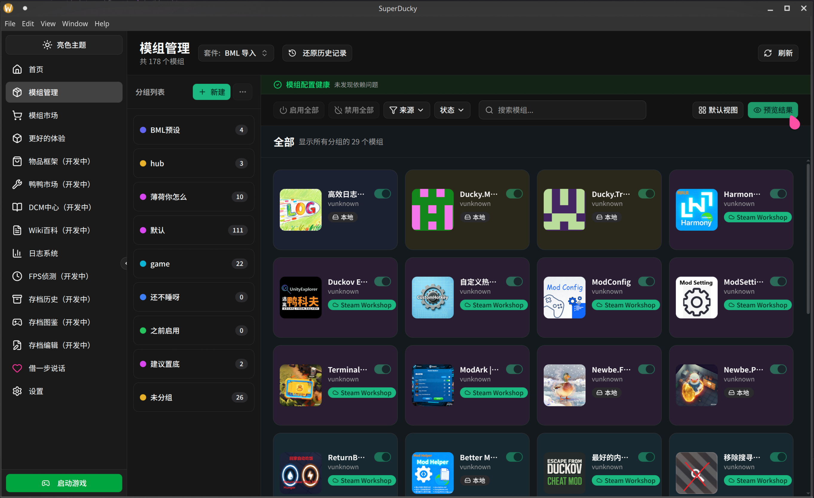
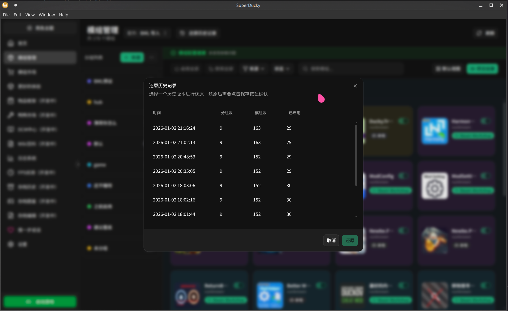
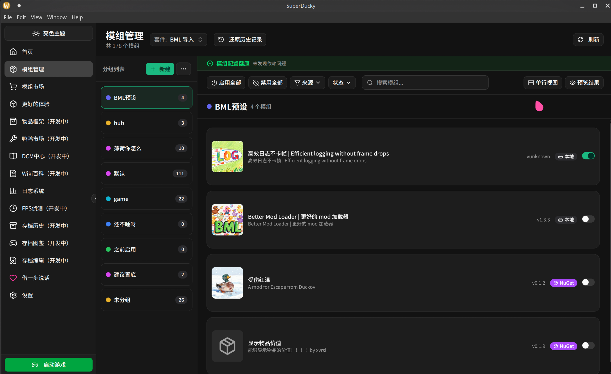
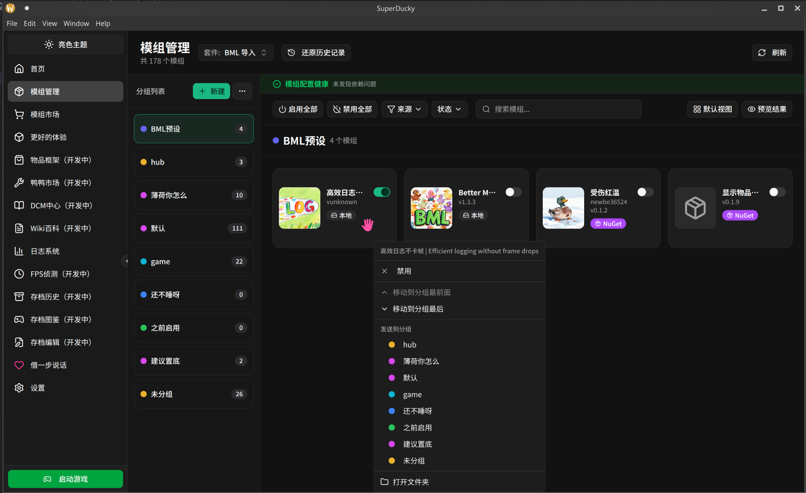
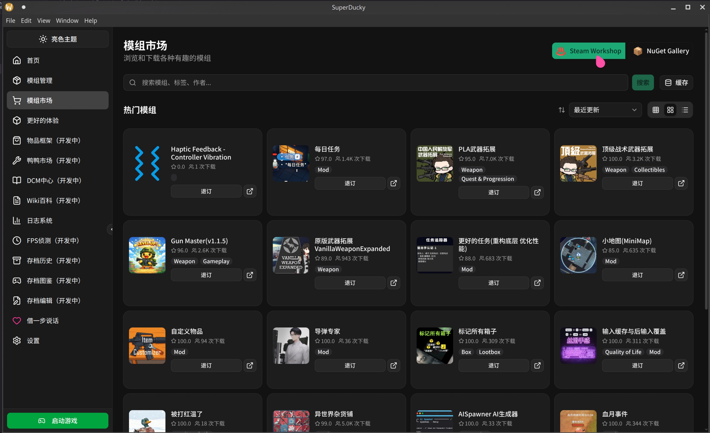
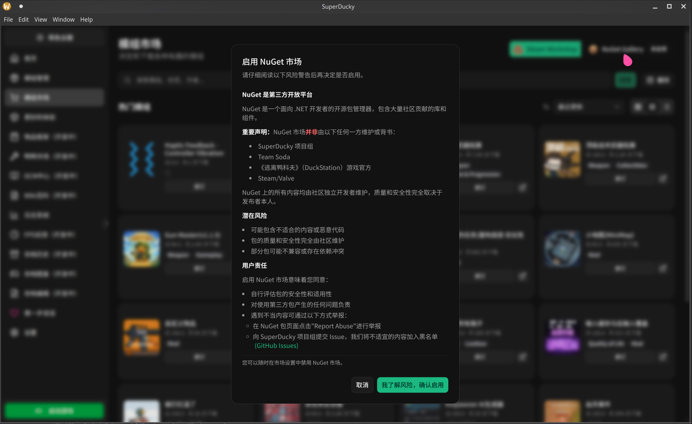
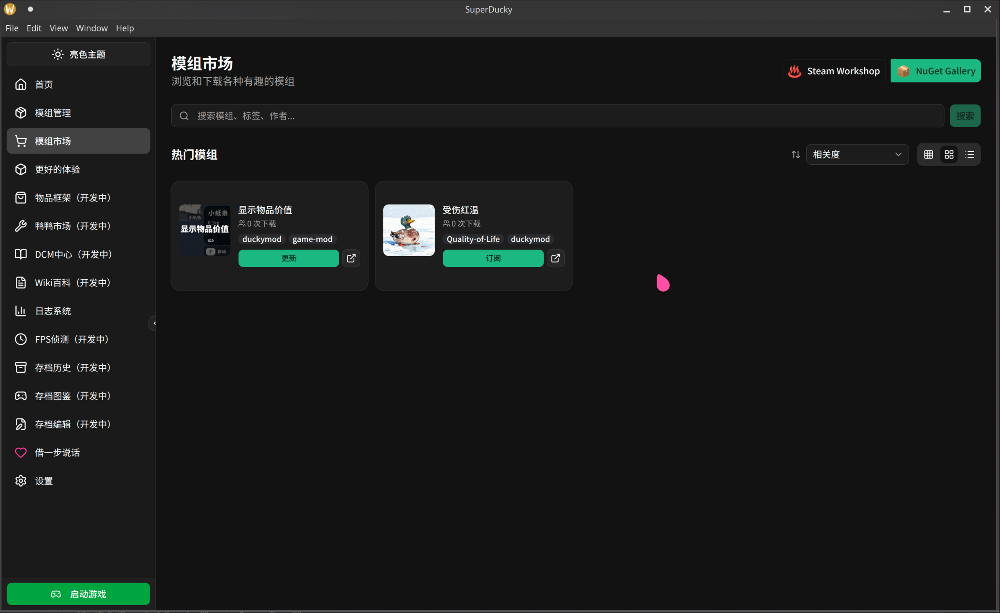
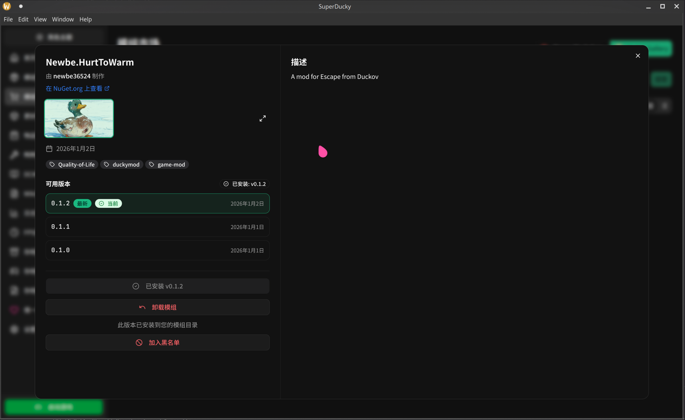
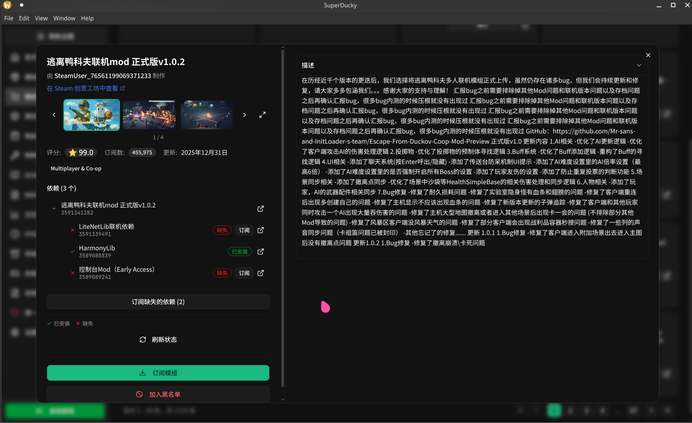
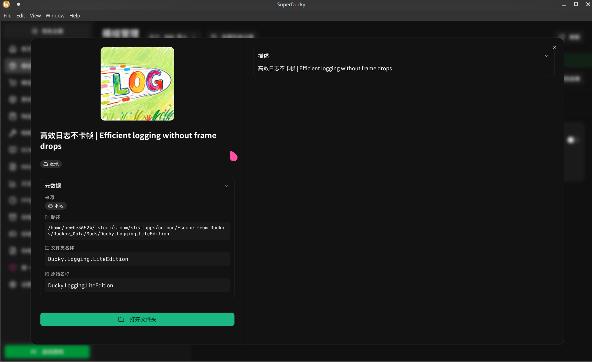
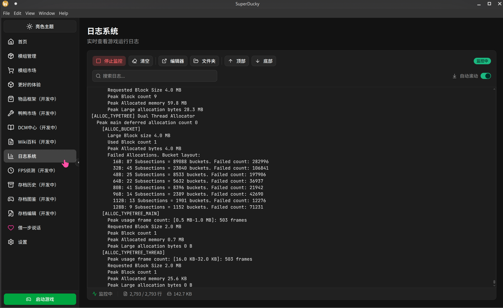
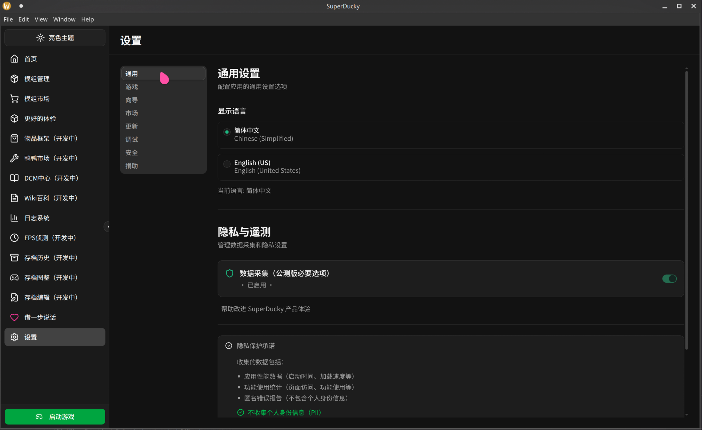

点击链接加入群聊【逃离鸭科夫 mod 技术交流】：https://qm.qq.com/q/6kHzE1Pjk4
